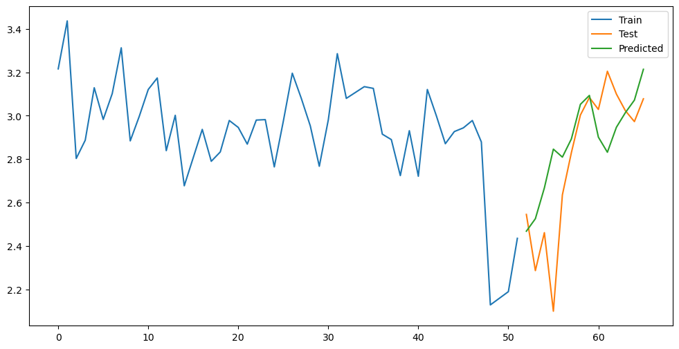
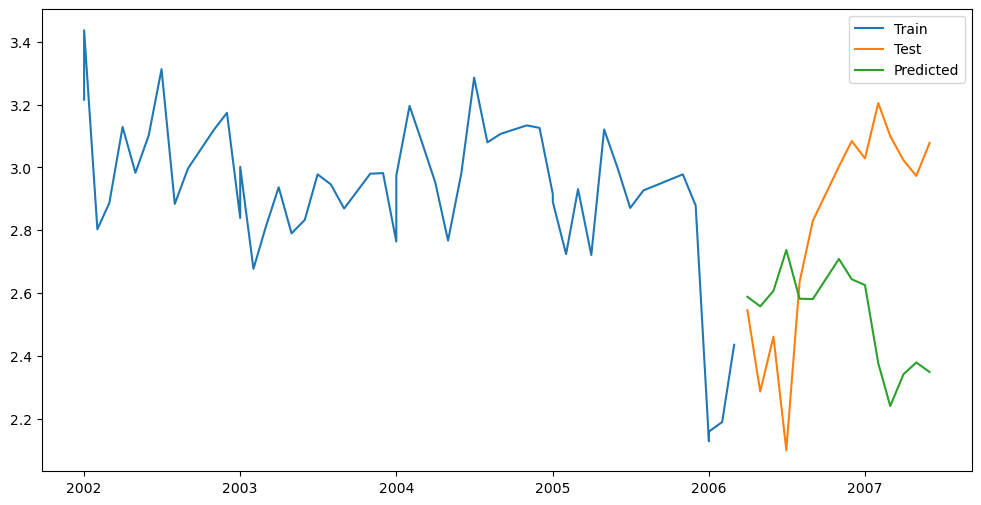

# GAM Model for Time-Series Forecasting
## About
Repository for Time Series Forecasting with Generalized Additive Models (GAM) case study. This case study explores and implements GAM model for accurate time series predictions on wastewater data from Sandomierz. 
This project includes a Jupyter notebook demonstrating the application of GAM model, providing insights, aiding in forecasting future trends in the wastewater time series dataset.

## Results

The GAM Model achieved amazing results after careful preprocessing and feature engineering and outperformed popular time-series model Prophet. 

| | GAM | Prophet |
|-----|------|-------|
| MSE | 0.06 | 0.27 |
| MAE | 0.18 | 0.45 |

## Plots

**GAM Predictions**

**Prophet Predictions**

## Other Info
It was made as part of Data Mining course on winter semester of Data Engineering and Analysis on AGH UST.
